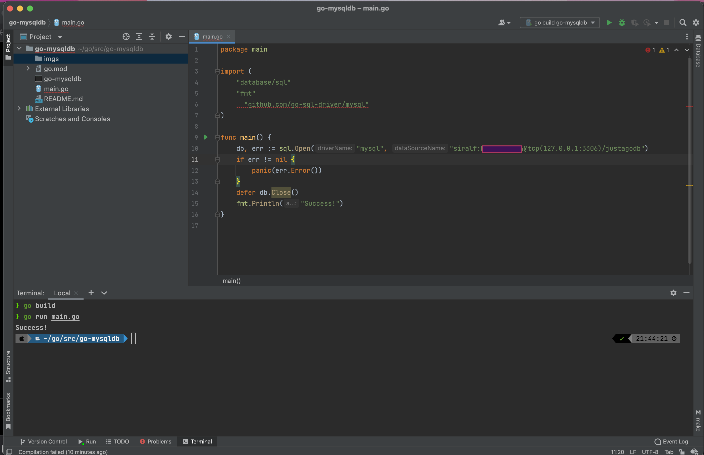

Go, also known as Golang, is a programming language that was developed by Google in 2009. It is a statically typed, compiled language that is designed to be simple, reliable, and efficient. Go is often used for developing web applications, cloud services, and distributed systems.

Here are some of the key features of Go:

Simple: Go is designed to be easy to learn and use. The syntax is clean and concise, and the language has a small number of keywords.
Reliable: Go is designed to be reliable and robust. The language has a number of features that help to prevent errors, such as type safety and garbage collection.
Efficient: Go is designed to be efficient. The language is compiled to native machine code, and it has a number of features that help to optimize performance.
Go is a popular language for a number of reasons. It is easy to learn and use, it is reliable and robust, and it is efficient. Go is a good choice for a wide range of projects, including web applications, cloud services, and distributed systems.

Here are some of the benefits of using Go:

Simple and easy to learn: Go is a simple language with a clean syntax. This makes it easy to learn and use, even for beginners.
Robust and reliable: Go is a robust language with a number of features that help to prevent errors. This makes it a good choice for projects where reliability is important.
Efficient: Go is a compiled language that is efficient in terms of both memory and CPU usage. This makes it a good choice for projects where performance is important.
Here are some of the challenges of using Go:

Lack of libraries: Go is a relatively new language, so there are not as many libraries available as there are for other languages.
Not as popular as other languages: Go is not as popular as some other languages, such as Java or Python. This can make it difficult to find help and support.
Not as well-documented as other languages: Go is not as well-documented as some other languages. This can make it difficult to learn and use.
Overall, Go is a powerful and versatile language that is a good choice for a wide range of projects. It is simple to learn and use, it is reliable and robust, and it is efficient. However, it is important to be aware of the challenges of using Go before making a decision.
Here is a quick test conn to a MySQL db

